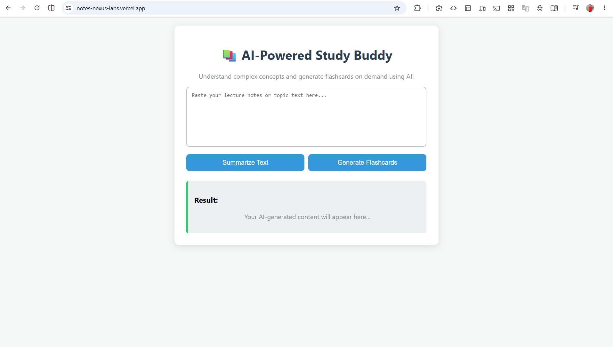

# 📚 Notes Nexus Labs - AI-Powered Study Buddy

An intelligent, interactive web application designed to help students and professionals condense long study materials and generate instant learning aids using Generative AI.

🌐 **Live Demo:** [https://notes-nexus-labs.vercel.app/](https://notes-nexus-labs.vercel.app/)

## 📸 App Interface



---

## 🚀 Features

*   🧠 **Smart Summarization:** Instantly condenses long, complex paragraphs or lecture notes into crisp, highly readable bullet points.
*   ⚡ **On-Demand Flashcards:** Automatically creates functional study flashcards from the provided text to help test your knowledge on the go.
*   🎨 **Clean & Responsive UI:** A modern, minimalist dashboard crafted for an optimal reading and studying experience.

---

## 🛠️ Tech Stack

*   **Frontend:** HTML5, CSS3, JavaScript
*   **Backend:** Python (Flask/Serverless)
*   **AI Engine:** Google Gemini API 🤖
*   **Deployment:** Hosted on Vercel Cloud Platform

---

## ⚙️ Installation & Local Setup

If you want to run this project locally, follow these steps:

1. **Clone the repository:**
```bash
   git clone [https://github.com/surajrajput999/AI-Study-Buddy.git](https://github.com/surajrajput999/AI-Study-Buddy.git)
   cd AI-Study-Buddy